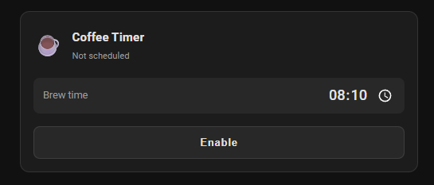
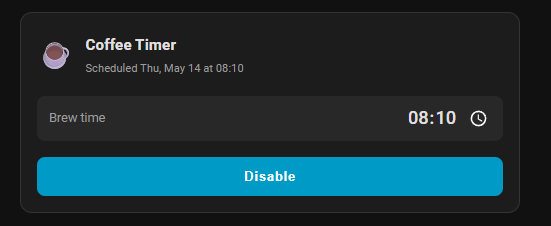

# ☕ Coffee Timer

A Home Assistant custom integration for scheduling a dumb coffee machine via a smart plug — with a custom Lovelace card to control it.

## Features

- **One-shot scheduling** — set a time, enable, and it fires once then disables itself
- **Survives restarts** — state is restored after HA reboots
- **Push notification** when brewing starts (configurable service, title, and message)
- **Custom Lovelace card** with inline time picker and enable/disable toggle
- **Visual card editor** — no YAML needed to configure the card

| Off | On |
|---|---|
|  |  |

## How it works

1. Leave the coffee machine switched on and the smart plug switched off before bed
2. Open the card, set your brew time, and tap **Enable**
3. At the scheduled time the plug turns on, the machine starts, and you get a notification
4. The schedule auto-disables — it won't fire again the next day unless you re-enable it

---

## Requirements

- Home Assistant 2023.0 or newer
- A smart plug exposed as a `switch` entity in HA

---

## Installation

### HACS (recommended)

1. Open HACS → Integrations → ⋮ → **Custom repositories**
2. Add `https://github.com/anton-gustafsson/coffee-timer` — category **Integration**
3. Search for **Coffee Timer** and install
4. Restart Home Assistant

### Manual

1. Copy `custom_components/coffee_timer/` into your HA config's `custom_components/` folder
2. Restart Home Assistant

---

## Integration setup

1. **Settings → Integrations → Add Integration → Coffee Timer**
2. Select your smart plug switch entity
3. Click **Configure** on the integration card to set:
   - **Notification Device** — dropdown of all registered notify services
   - **Notification Title** — e.g. `Good Morning`
   - **Notification Message** — e.g. `Started Brewing Coffee`

---

## Lovelace card

The card is bundled inside the integration. After installing and restarting HA, the card is served and registered as a Lovelace resource automatically — no extra steps needed.

In the Lovelace card picker, search for **Coffee Timer** — it has a built-in visual editor.

Or add it manually in YAML:

```yaml
type: custom:coffee-timer-card
switch_entity: switch.coffee_timer_enabled
time_entity: time.coffee_timer_brew_time
name: Coffee Timer
```

> **yaml-mode Lovelace:** add the resource manually under `resources:` with URL `/coffee_timer/coffee_timer_card.js` and type `module`.

---

## Entities created

| Entity | Type | Description |
|---|---|---|
| `switch.coffee_timer_enabled` | Switch | Enable / disable the schedule |
| `time.coffee_timer_brew_time` | Time | The time to start the machine |

The switch exposes a `next_brew_time` attribute (ISO 8601) used by the card to display the scheduled date.

---

## Brand


Source SVG is in `brand/icon.svg`. To submit to [home-assistant/brands](https://github.com/home-assistant/brands), export it as:
- `icon.png` — 256×256 px
- `icon@2x.png` — 512×512 px

---

## License

MIT — see [LICENSE](LICENSE)
